# MAMA-MIA CHALLENGE

## Authors

- Kacper Janiszewski
- Krzysztof Nosek
- Róża Mazurek

## Project Objective
This project aims to analyze Clinical Data and patterns extracted from DCE-MRI images of breast cancer patients to predict their response to neoadjuvant chemotherapy - pCR.
- pCR = 1: no invasive cancer left after treatment - complete response,
- pCR = 0: residual cancer still present.

## Data Preparation
The dataset provided for the challenge consisted of a CSV file containing clinical information for 1,506 breast cancer patients, along with DCE-MRI (Dynamic Contrast-Enhanced MRI) images acquired in sequential phases—each phase corresponding to one additional second after applying contrast. Additionally, the dataset included both expert and automathic tumor segmentations for all patients.

Before training our model we had to prepare the data. This involved organizing the data into separate folders for each patient, applying segmentation masks to each phase image to mark the tumor, and subsequently cropping the image volumes around the tumor area. We then calculated contrast differences across phases to capture temporal dynamics.
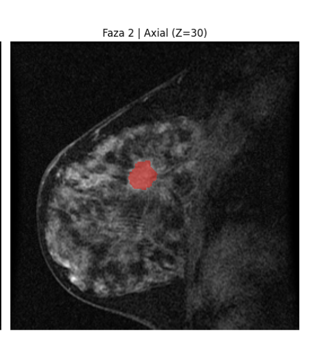
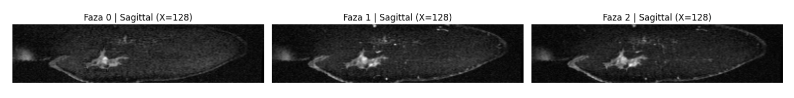
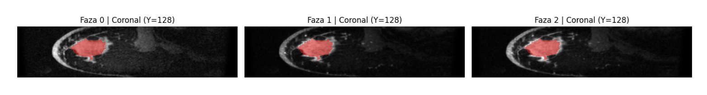
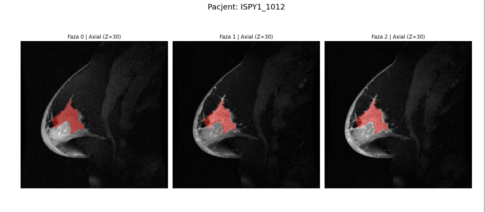

Since the DCE-MRI data are inherently 3D volumes, we extracted slices along each axis (X, Y, Z) for all phases. This prepared dataset was then used as input for our downstream machine learning models.
## Project Folder Structure

## Data obtained from MRI images
For each patient, we calculated a TIC (Time-Intensity Curve)—a curve that shows how contrast intensity in the breast tumor region changes over time.

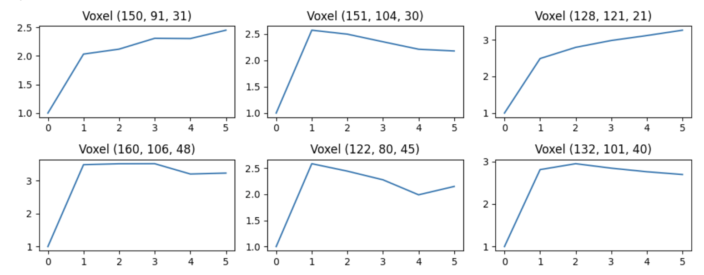

The plots above illustrate the contrast dynamics for six randomly selected voxels within the tumor of a single patient, demonstrating how signal intensity evolves across time points.

For every patient, we then extracted average values across all tumor voxels for the following features:

* Wash-in rate: how quickly signal intensity increases after contrast injection:
    * Nonenhanced — < 0.1
    * Slow — 0.1 ≤ rate < 0.5
    * Medium — 0.5 ≤ rate < 1.0
    * Fast — ≥ 1.0
* Wash-out stability: how consistent the signal is during wash-out:
    * Steady — < 0.1
    * Non-steady — ≥ 0.

    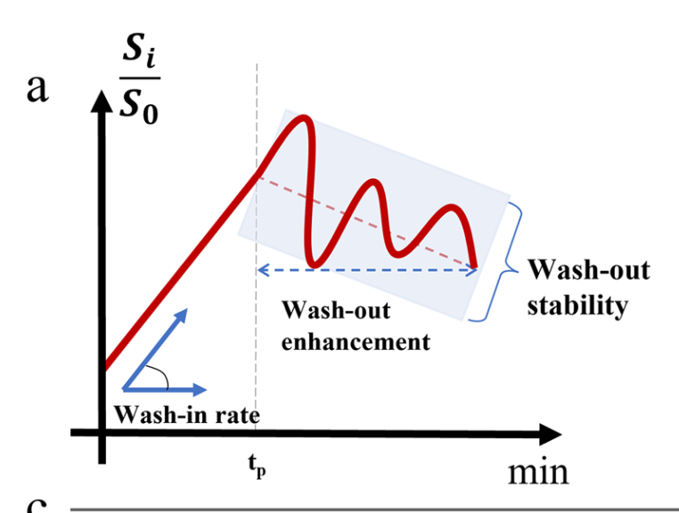

* Wash-out enhancement: how intensity declines (or not) after the peak.
We averaged these values per patient and used wash-out enhancement as the main factor to classify the tumor into a TIC type corresponding to Nottingham Grade:
    * Persistent — > 0.05 -> Type I -> Nottingam Grade Low
    * Plateau — −0.05 ≤ value ≤ 0.05 -> Type II -> Nottingham Grade Medium
    * Decline — < −0.05 -> Type III ->Nottingham Grade High

    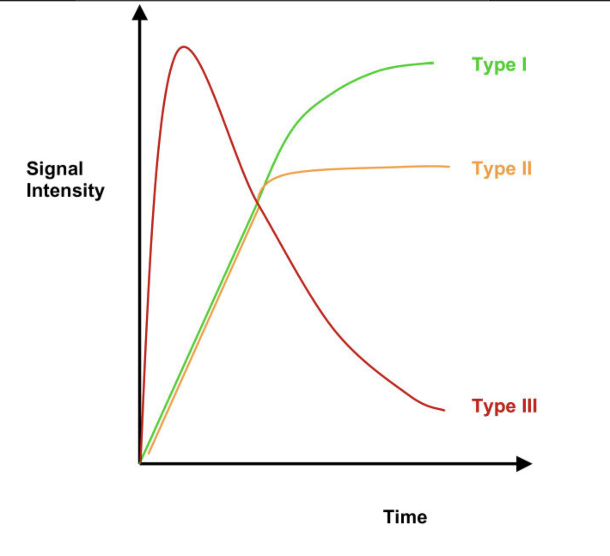

## How we used it

The clinical CSV had many missing Nottingham Grade values. Since Nottingham Grade is key to estimating tumor aggressiveness, we filled these missing values using image-derived dominant TIC types based on the wash-out enhancement rule above. This made our dataset more complete and reliable. Using both the original Nottingham grade and the image-based dominant types improved our model's accuracy.

Finally, we added the followed values to the clinical dataset:
* Voxel count per TIC type (I, II, III),
* Dominant TIC type for each patient,
* Average wash-in rate, wash-out enhancement, and wash-out stability.

Finally, we added the followed values to the clinical dataset:

- Voxel count per TIC type (I, II, III),
- Dominant TIC type for each patient,
- Average wash-in rate, wash-out enhancement, and wash-out stability.

## Statistics
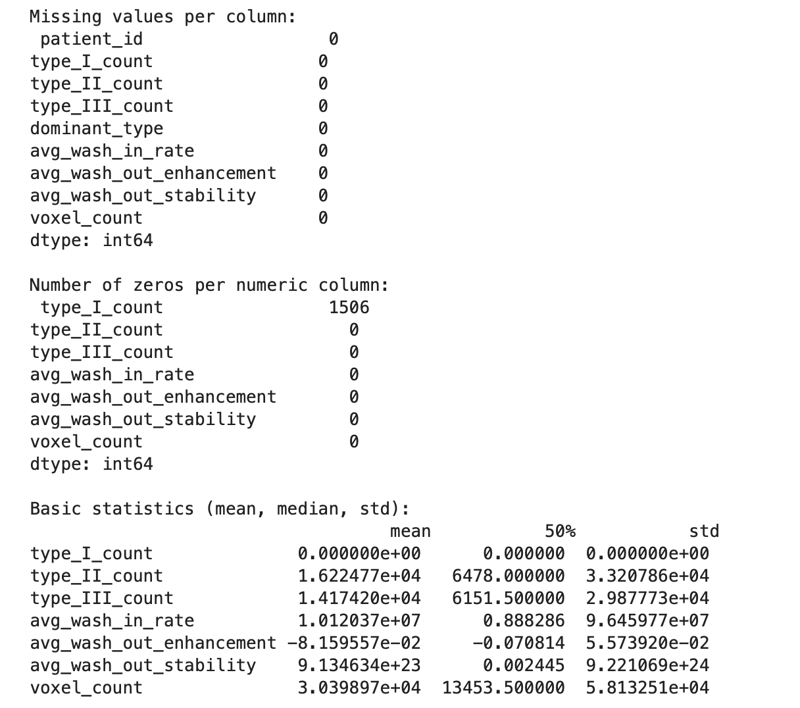

Distribution of Nottingham Grades

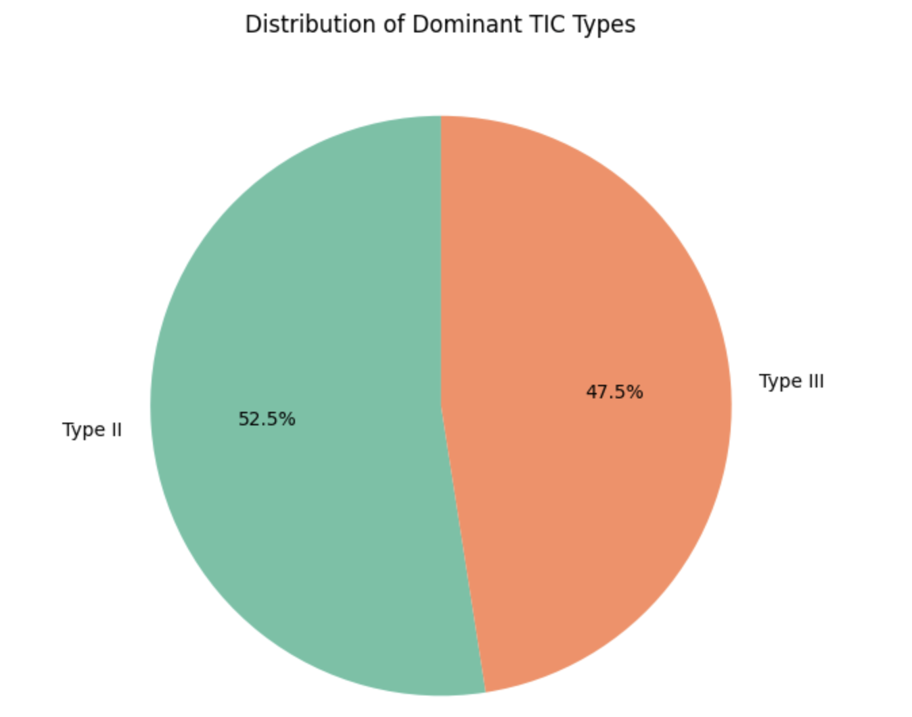

Scatter plot showing the relationship between wash-in rate and wash-out enhancement:

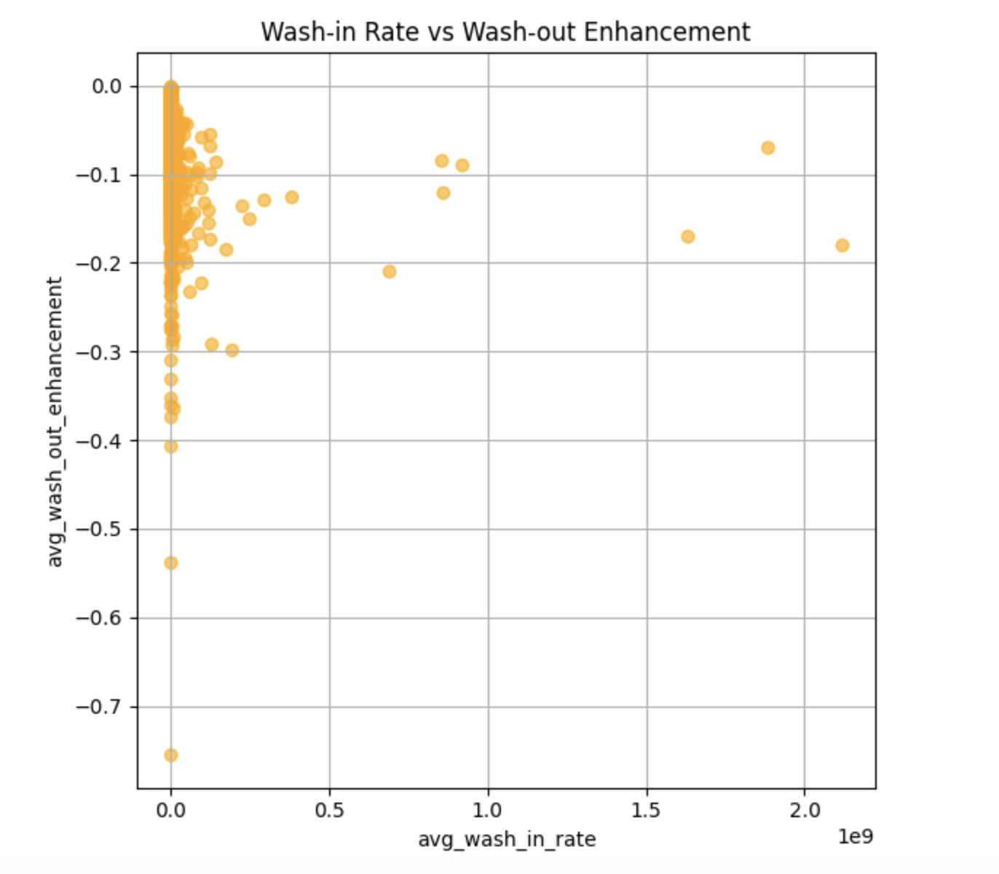

## Clinical Data - CSV File

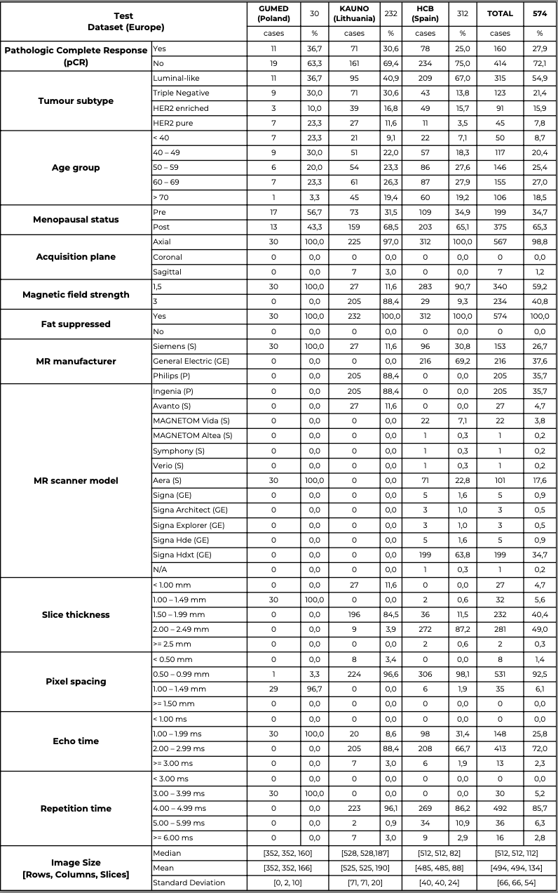

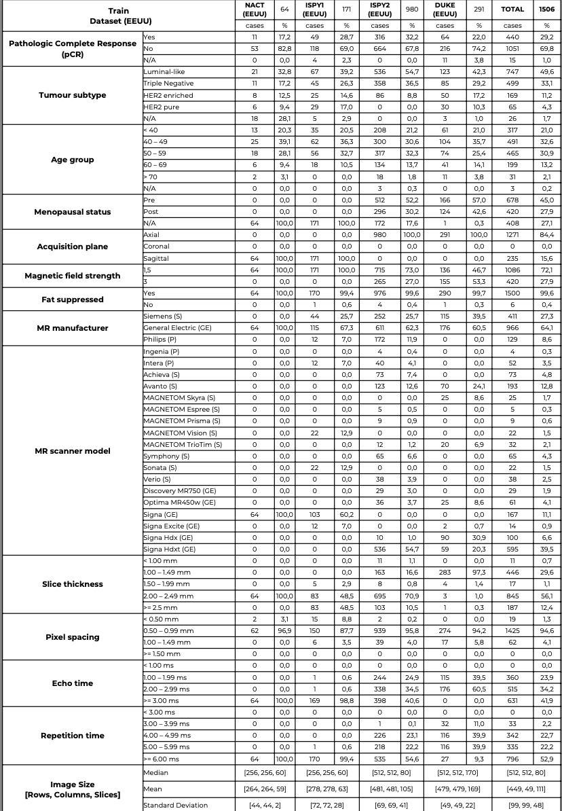

## Technologies Used
- Python 3.8+
- numpy – array and math operations
- matplotlib – optional visualization
- scikit-learn – linear regression (for wash-out trend)
- nibabel – medical image I/O (.nii.gz)
- csv – writing tabular outputs
- Supercomputer cluster – used for processing large image datasets efficiently
## Model
## Results
## User Interface

